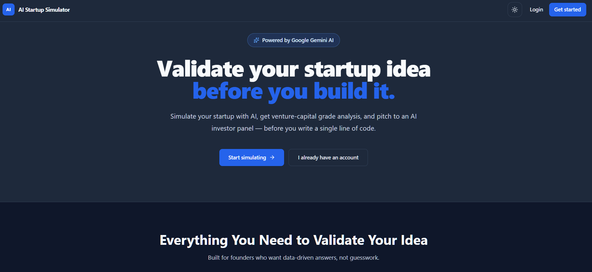
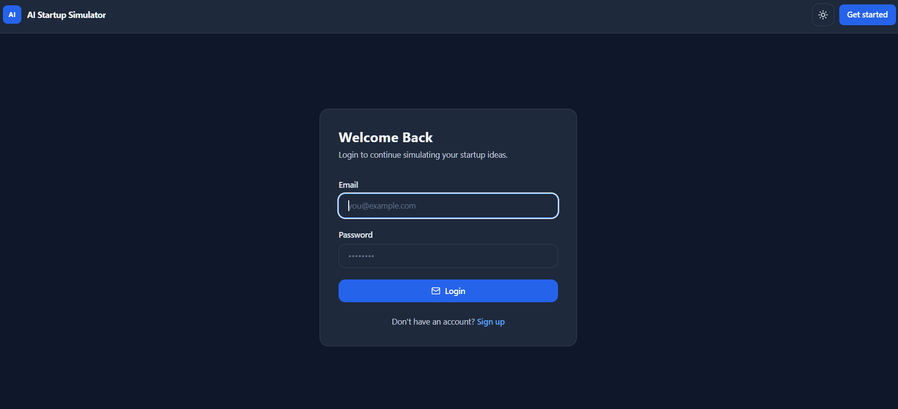
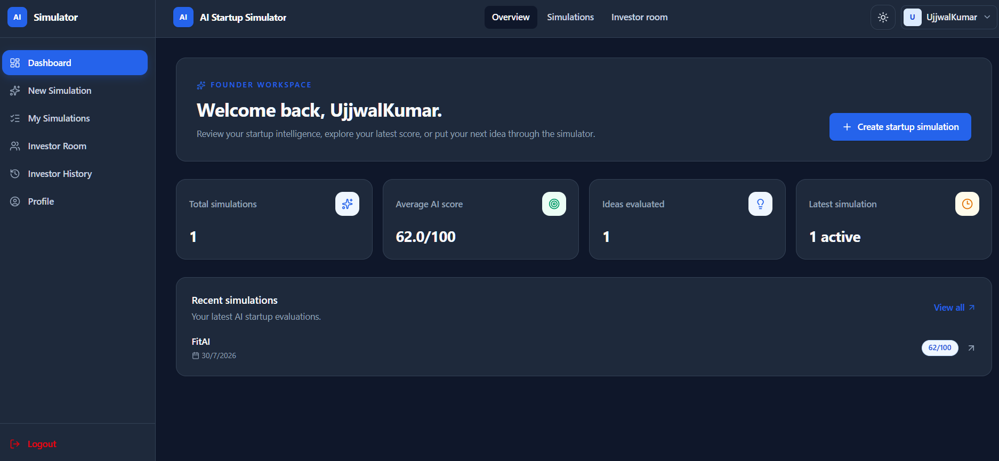
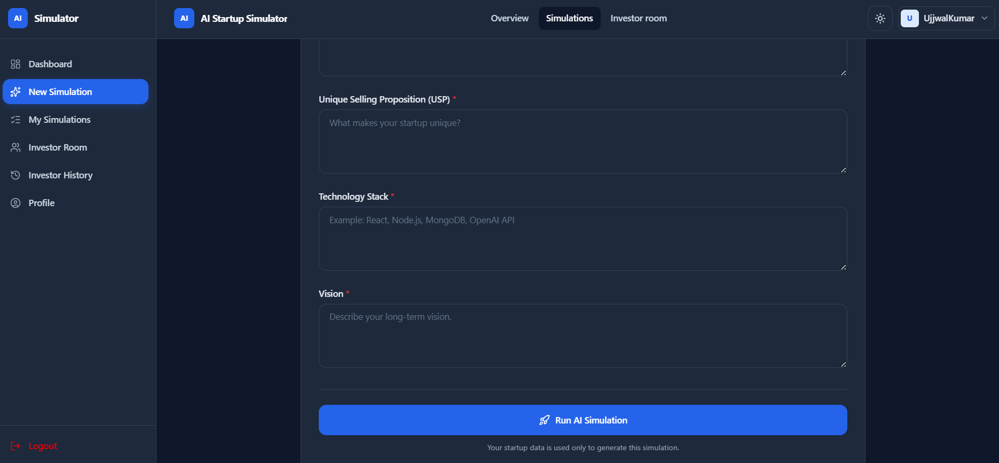
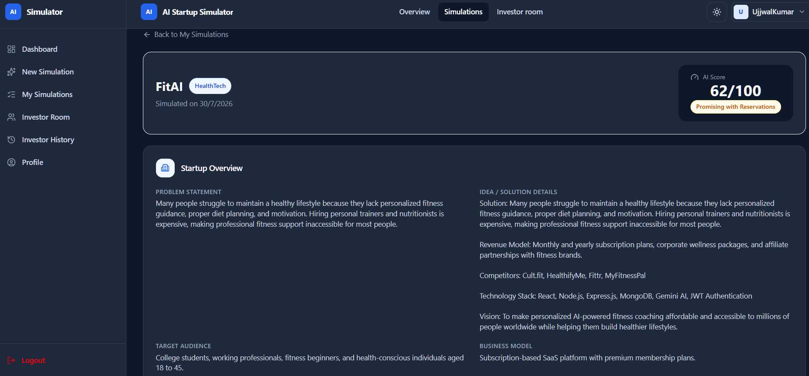
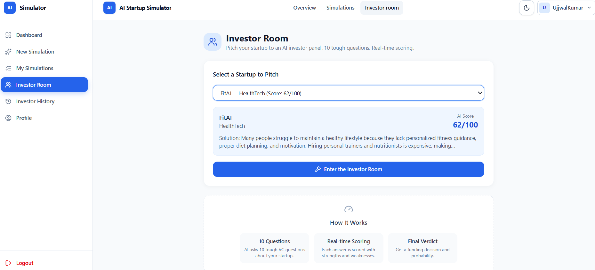
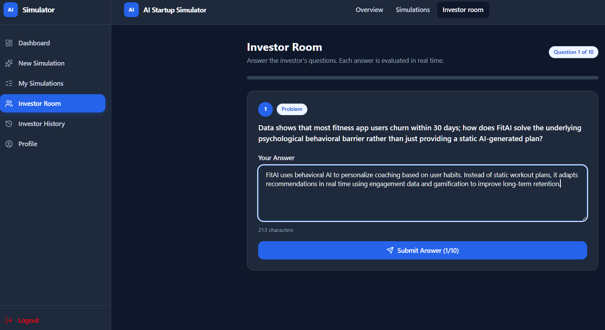
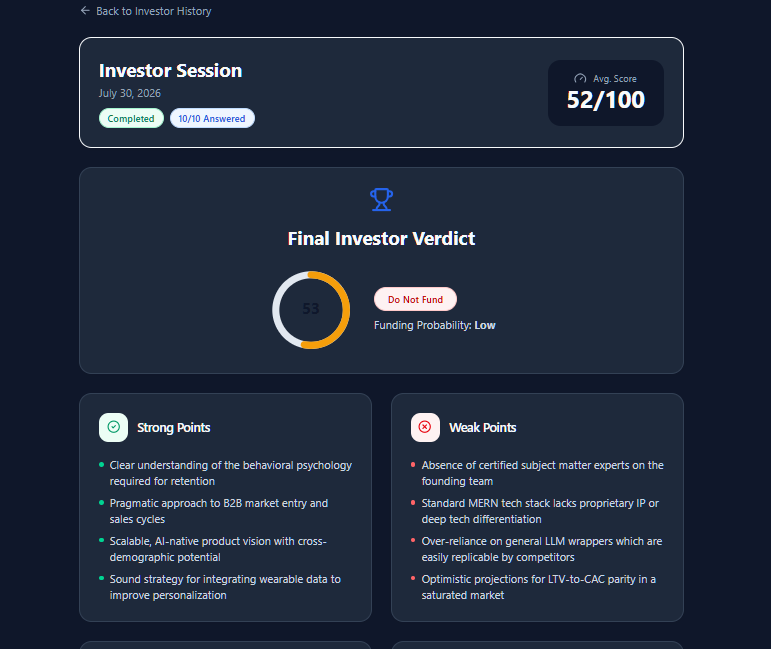
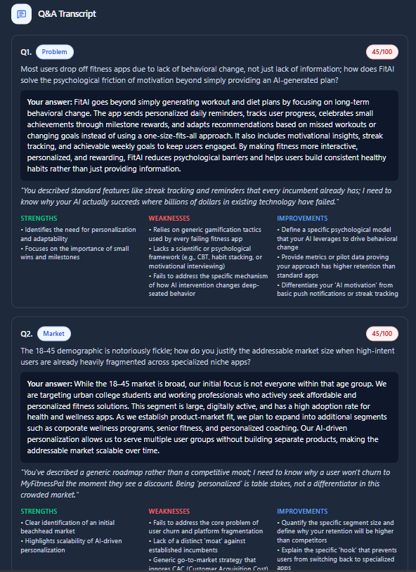

# 🚀 AI Startup Simulator

An AI-powered full-stack platform that helps founders validate startup ideas before building them. The application generates detailed startup analysis using Google Gemini AI and allows users to pitch their startup to an AI-powered investor panel for real-time evaluation and funding recommendations.

---

## ✨ Features

- 🤖 AI-powered startup idea evaluation using Google Gemini AI
- 📊 Comprehensive startup analysis with startup scoring
- 💡 AI-generated recommendations and funding insights
- 🎯 Interactive AI Investor Room with 10 real-world VC questions
- 📈 Real-time scoring and feedback for every investor answer
- 🏆 Final investor verdict with funding probability
- 📝 Complete investor Q&A transcript with strengths, weaknesses, and improvements
- 🔐 Secure JWT Authentication
- 🌙 Dark & Light Theme
- 📱 Responsive UI
- 📂 Simulation and investor session history

---

## 🛠 Tech Stack

### Frontend
- React.js
- React Router DOM
- Tailwind CSS
- Axios
- Framer Motion
- Lucide React
- React Hot Toast

### Backend
- Node.js
- Express.js
- MongoDB
- Mongoose
- JWT Authentication
- Bcrypt

### AI
- Google Gemini AI

### Tools
- Git
- GitHub
- VS Code
- Postman

---

# 📸 Application Screenshots

## Landing Page



---

## Sign In



---

## Dashboard



---

## New Startup Simulation



---

## AI Startup Analysis



---

## Investor Room



---

## AI Investor Interview



---

## Investor Final Verdict



---

## Investor Q&A Transcript



---

# ⚙️ Installation

## Clone Repository

```bash
git clone https://github.com/ujjwalkumar1here/ai-startup-simulator.git
```

```bash
cd ai-startup-simulator
```

---

## Backend

```bash
cd backend
npm install
```

Create a `.env` file using `.env.example`.

Start the backend server:

```bash
npm run dev
```

---

## Frontend

```bash
cd frontend
npm install
```

Start the frontend server:

```bash
npm run dev
```

---

# 🔑 Environment Variables

Backend `.env`

```env
PORT=
MONGODB_URI=
JWT_SECRET=
GEMINI_API_KEY=
GEMINI_MODEL=
NODE_ENV=
```

---

# 📂 Project Structure

```
ai-startup-simulator
│
├── backend
│   ├── src
│   ├── package.json
│   └── .env.example
│
├── frontend
│   ├── src
│   ├── public
│   └── package.json
│
├── screenshot
│
└── README.md
```

---

# 🚀 Future Improvements

- Google Authentication
- AI-generated pitch deck
- Startup comparison dashboard
- Team collaboration
- Email notifications
- Export analysis as PDF
- Multi-language support

---

# 👨‍💻 Author

**Ujjwal Kumar**

📧 ujjwalrajput.here@gmail.com

GitHub:
https://github.com/ujjwalkumar1here

LinkedIn:
https://www.linkedin.com/in/ujjwal-kumar-015042325

---

⭐ If you found this project useful, consider giving it a star!